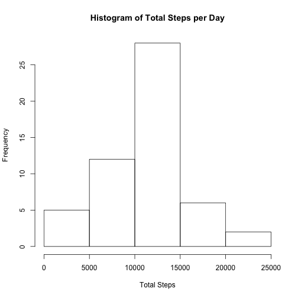
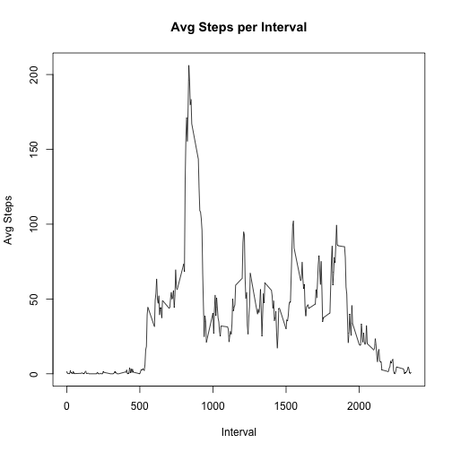
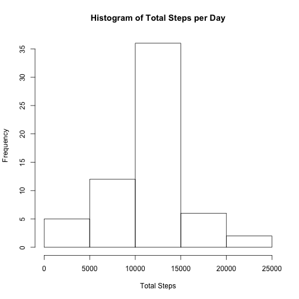
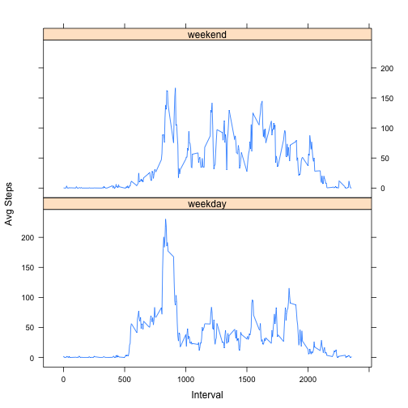

## Loading and preprocessing the data

```r
setwd('~/Documents/Coursera/Data Science/Reproducible Research/hw1')
activity_df <- read.csv('activity.csv')
names(activity_df)
```

```
## [1] "steps"    "date"     "interval"
```

```r
str(activity_df)
```

```
## 'data.frame':	17568 obs. of  3 variables:
##  $ steps   : int  NA NA NA NA NA NA NA NA NA NA ...
##  $ date    : Factor w/ 61 levels "2012-10-01","2012-10-02",..: 1 1 1 1 1 1 1 1 1 1 ...
##  $ interval: int  0 5 10 15 20 25 30 35 40 45 ...
```

## What is mean total number of steps taken per day?
- Calculate the total number of stpes taken each day

```r
total_steps<-aggregate(steps~date,data=activity_df,sum,na.rm=TRUE)
```
- Make a histogram of the total number of steps taken each day

```r
hist(total_steps$steps, xlab = 'Total Steps', main = 'Histogram of Total Steps per Day')
```



- Mean and median of the total number of steps taken per day

```r
mean_step <- mean(total_steps$steps)
median_step <- median(total_steps$steps)
```
The mean is 10766.19, the median is 10765. 

## What is the average daily activity pattern?
- Make a time series plot of the 5-minute interval and the average number of steps taken.

```r
interval_df <- aggregate(steps~interval,data=activity_df,mean,na.rm=TRUE)
plot(x = interval_df$interval, y = interval_df$steps, type = 'l', xlab = 'Interval',
     ylab = 'Avg Steps', main = 'Avg Steps per Interval')
```



- Which 5-min interval, on average across all the days in the dataset, contains the maximum number of steps?

```r
max_interval <- interval_df[which.max(interval_df$steps), 'interval']
```
The 835th interval contains the maximum number of steps. 

## Imputing missing values
- Calculate and report the total number of missing values in the dataset.
The total number of missing value in each column is showed below.

```r
colSums(is.na(activity_df))
```

```
##    steps     date interval 
##     2304        0        0
```
- Use the mean for that 5-min interval to filling in all of the missing values in the dataset. 

```r
impute_func = function(row_ind) {
  step_val <- activity_df$steps[row_ind]
  if (is.na(step_val)) {
    interval_val <- activity_df$interval[row_ind]
    interval_df[interval_df$interval == interval_val, 'steps']
  } else{
    step_val
  }
}

new_steps <- c()
for (i in 1:nrow(activity_df)){
  new_steps <- c(new_steps, impute_func(i))
}
```
- Create a new dataset that is equal to the original dataset but with the missing data filled in.

```r
new_activity_df <- data.frame(steps = new_steps, date = activity_df$date, interval = activity_df$interval)
```
- Make a histogram of the total number of steps taken each day and Calculate and report the mean and median total number of steps taken per day.
 

```r
total_steps_new <- aggregate(steps ~ date, data = new_activity_df, sum)
hist(total_steps_new$steps, xlab = 'Total Steps', main = 'Histogram of Total Steps per Day')
```



```r
mean_step_new <- mean(total_steps_new$steps)
median_step_new <- median(total_steps_new$steps)
```
The median total steps for the new data is 10766.19, the mean total steps for the new data is 10766.19. They are pretty close to those mean and median calculated from the data with missing value.

## Are there differences in activity patterns between weekdays and weekends?
- Create a new factor variable in the dataset with two levels: weekday or weekend

```r
new_activity_df$date <- as.Date(new_activity_df$date, format = "%Y-%m-%d", tz = 'PST')
new_activity_df$day <- ifelse(weekdays(new_activity_df$date) == 'Saturday'| weekdays(new_activity_df$date) == 'Sunday', 'weekend', 'weekday')
```

- Make a panel plot containing a time series plot (i.e. type = "l") of the 5-minute interval (x-axis) and the average number of steps taken, averaged across all weekday days or weekend days (y-axis)

```r
interval_total_df <-  aggregate(steps ~ interval + day, data = new_activity_df ,mean)
library(lattice)
xyplot(steps ~ interval | day, data = interval_total_df,
      type = 'l',
      xlab = 'Interval',
      ylab = 'Avg Steps',
      layout = c(1,2))
```


